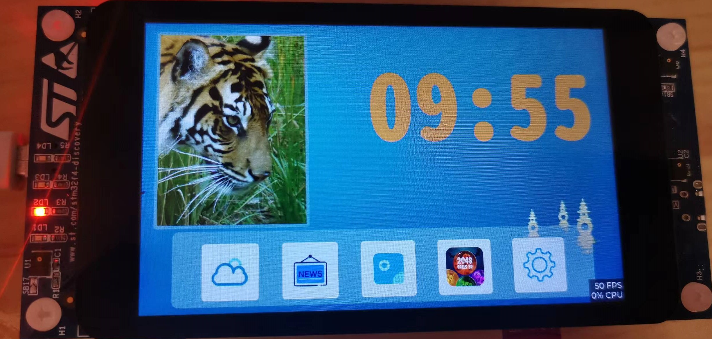
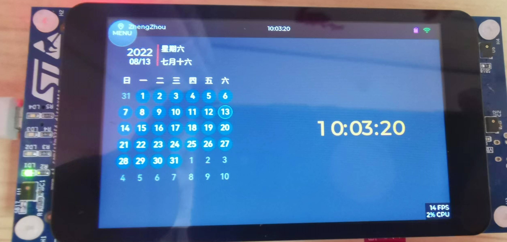
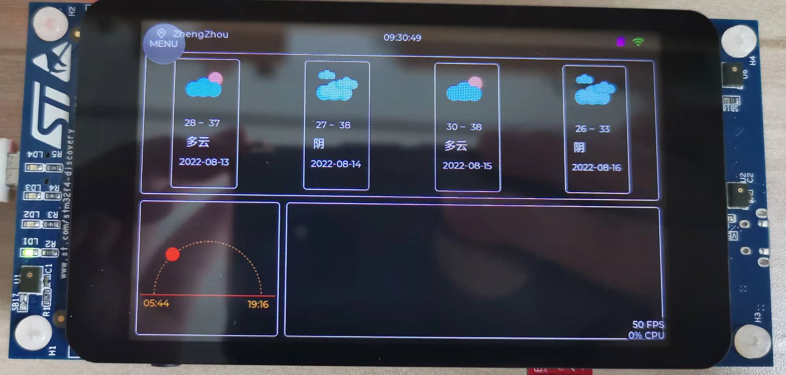
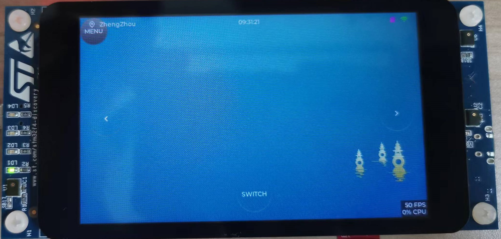
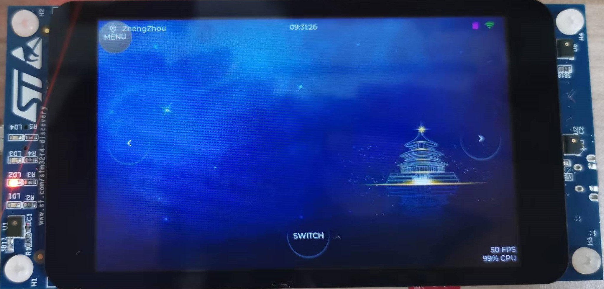
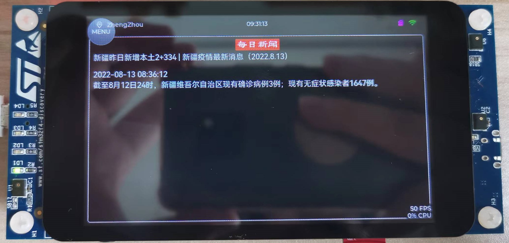
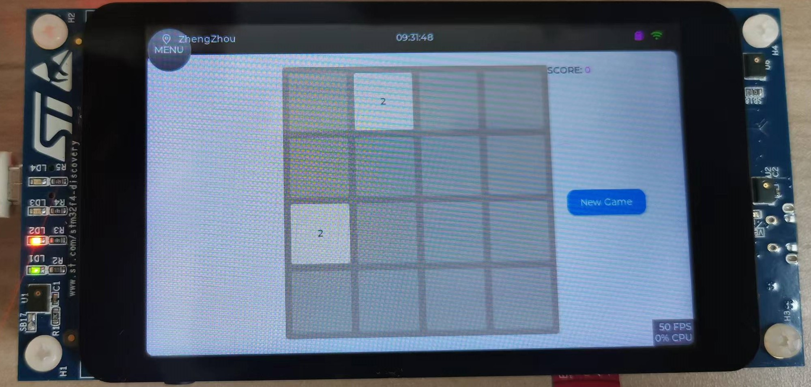
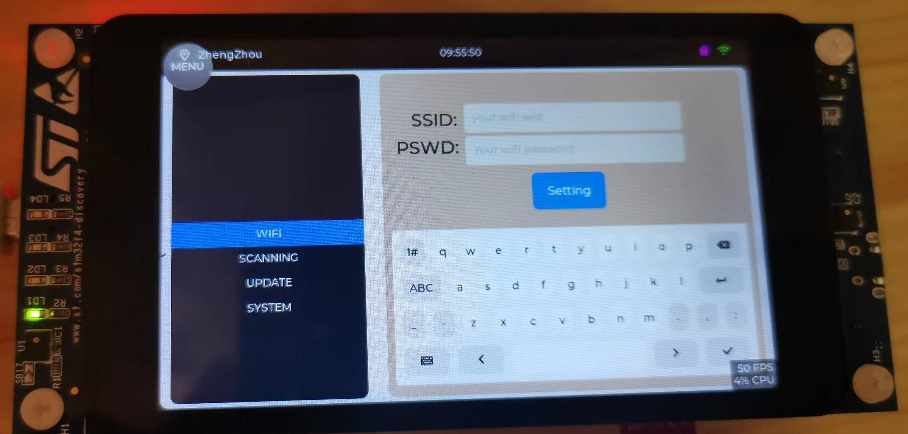

# 基于 RT-Thread 和 LVGL 设计的桌面电子相册


## 比赛说明

  本仓库代码主要用于参加RT-Thread 社区举办的嵌入式GUI挑战赛，比赛链接如下：

[https://club.rt-thread.org/ask/article/fdf5ad5909eef6ba.html](https://club.rt-thread.org/ask/article/fdf5ad5909eef6ba.html)

  我主要想通过本次比赛，设计一款基于LVGL的桌面电子相册，主要功能包括：
- 支持连接互联网
- 支持图片显示，定时刷新图片
- 支持获取当地天气信息
- 支持获取国内热点新闻
- 支持获取其它物联网摄像头的图片信息

  本次比赛，我申请的是 STM32F469-Discovery 开发板，感谢RT-Thread 提供硬件支持。

## 演示视频
  视频和图片说明： 由于仓库代码还在不断更新，演示界面和实际的功能可能有所区别。

[B站视频链接](https://www.bilibili.com/video/BV1aN4y1G7Ua)

## 硬件说明

- STM32F469-Discovery
	- MCU  STM32F469NIH6U 主频 180MHz，2048KB FLASH ，384KB (包含64KB 的 CCM) RAM
	- SRAM 25Q128A，16MB 
	- QSPI-FLASH 7LL12D9NOR，16MB
	- LCD：4寸800×480TFT屏

  由于 STM32F469-Discovery 开发板本身没有网络模块，不具备联网能力，但是其提供了 Arduino UNO 的标准硬件接口，因此硬件上我们还需要设计一个WIFI模块，为 STM32F469 提供网络连接功能。该硬件由我自己设计，适配 STM32F469-Discovery 开发板，硬件开源。

- ESP32-Arduino 
	- 板载 ESP32-WROVER 模组


## 软件开发环境说明
  本工程使用 MDK5构建，rt-thread 的配置使用 env工具构建。

## SD卡存储目录说明

```
Directory /:
imgs                <DIR>  // 图片示例目录存放 800*480 图片 jpg 或者 png 格式
tmp                 <DIR>  // 临时文件
conf                <DIR>  // 系统配置目录
tools               <DIR>  // 工具目录
album               <DIR>  // 相册目录 暂时没有使用
minimgs             <DIR>  // 小图片 存放 240*320 像素图片

```

## 系统配置文件模板

  系统配置文件格式采用 JSON 格式，具体包含以下配置信息,系统配置文件存放在 `/conf` 目录下。


```
 /conf/gui.conf
{
        "ssid": "wifissid",
        "passwd":       "1234567890",
        "apikey":       "********************************",
		"cityname":"zhengzhou",
        "cityid":       "101180101"
}
```
  项目中实现了配置文件的读写功能，可以对系统配置参数进行修改设置。

## 功能设计

- 主界面
	- 电子相册
	- 天气预报
	- 每日新闻
	- 小游戏
	- 系统设置

## 硬件设计

### ESP32-Arduino 定制开发板设计

  STM32F469-Discovery 开发板上默认没有配置网卡，但是支持标准的 Arduino UNO 硬件接口。为了支持网络连接功能，特意为该开发板设计了一块ESP32-Arduino 定制网卡开发板 。ESP32-Arduino 和STM32F469-Discovery 之间使用串口进行通信。通过 RT-Thread 带有的 AT 软件包来驱动 ESP32，完成完成网络连接功能。

  本次硬件设计部分使用 立创EDA完成设计工作。ESP32-Arduino 开发板的开源工程链接如下。

[https://oshwhub.com/piaoxuebingfeng/esp32_arduino_uno_type-c](https://oshwhub.com/piaoxuebingfeng/esp32_arduino_uno_type-c)

## 软件设计

### 基础功能构建

#### STM32 FLASH 分散加载
  这款开发板上的STM32内置有 2MB 的 flash，正常开发单片机的程序绝对是够用了，但是由于本次设计是针对GUI的，需要引入非常多的图片资源，这样的话，2MB 的 flash 空间就显得有点小了，好在开发板上面还板载了一颗 16MB 大小的 QSPI FLASH,这样的话，就要想办法将这个外部的FLASH 使用起来。
  STM32 的芯片大都提供有 FLASH 分散加载功能，意思就是能够同时将生成的bin文件拆开，分门别类的存放到不同的 FLASH 空间中。在这里，我们就使用到了 FLASH 分散加载算法来将一些较大的必备图片数据保存到外部FLASH 中。

#### LVGL 性能优化
  LVGL 性能优化部分这里只是简单进行了优化，主要是扩大了 LVGL 的 framebuffer,利用LVGL 的双缓冲区，并利用了外置的SRAM区域。具体实现在 `applications/lvgl/lv_port_disp.c` 中。

```
#define LV_DISP_SRAM_START_ADDR (0xC0000000 + 10*1024*1024)

#define DISP_BUF_SIZE        (LV_HOR_RES_MAX * LV_VER_RES_MAX )
static lv_color_t  lv_disp_buf1[DISP_BUF_SIZE] __attribute__((at(LV_DISP_SRAM_START_ADDR+DISP_BUF_SIZE*2)))={0};
static lv_color_t  lv_disp_buf2[DISP_BUF_SIZE] __attribute__((at(LV_DISP_SRAM_START_ADDR+DISP_BUF_SIZE*4)))={0};

```
  此外，还在`lv_conf.h`中设置了LVGL 的刷新周期。
```
#define LV_DISP_DEF_REFR_PERIOD 20

```
#### LVGL 对接 FS
  rt-thread 官方提供的 LVGL 还没有对接 FS,由于本次设计中需要加载外部图片，因此需要LVGL对接FS的功能。RT-Thread提供了 DFS 虚拟文件系统标准接口，因此本项目中我们直接对接DFS提供的接口。具体的实现请参考 `applications/lvgl/lv_port_fs.c`
#### 使能 UART6
  rt-thread 针对 stm32f469-discovery 开发板提供的bsp中没有开启 UART6,由于本次设计中要使用UART6和ESP32 进行串口通信，实现网络功能，因此需要在STM32 HAL 驱动中使能 UART6.

#### ESP32 联网

#### 获取网络数据
  使用 wget 获取网络数据。


### 界面设计
  界面设计相关的代码主要在 `applications/lv_desktop_gui/` 目录下。详细的代码请查看相关源码。这里介绍下每一个界面的主要功能。

#### 主界面设计
  主界面主要实现了相册轮播、时间显示和应用切换功能。



#### 时钟界面
  时钟界面加入了日历功能，支持农历日历的显示，并且对时钟显示功能进行了优化，加入了时钟动画。


#### 天气界面
  天气界面实现了未来5天的天气实时显示，日出日落显示功能。其中自己设计了一个日出日落控件，用来实现日出日落的可视化效果。


#### 相册界面
  相册界面主要实现了本地照片的轮播，后台还会定时的从图片服务器上面同步图片到本地，这样就不用手动将图片导入到本地SD卡中了，可以直接将图片上传到服务器中，实现相片的同步。





#### 新闻界面
  新闻界面用来实时显示新闻信息，其中新闻数据主要来自于天行数据库。



#### 游戏界面
  游戏界面实现了 2048 游戏，2048 游戏主要是移植于 10ask 开源的LVGL lib库。


#### 系统配置界面
  系统配置界面目前只是实现了WIFI设置以及城市ID设置功能，比较简单。


#### 自定义控件

##### 自定义日出日落显示控件
  日出日落控件是利用 lv_canvas 组件编写出来的，目前能够支持显示日出日落时间，以及显示当前太阳的位置。

##### 自定义日历控件
  LVGL8.2 中自带的日历控件已经取消了修改样式相关API,而默认的 LVGL的日历控件的样式又不太好看，因此，笔者通过修改日历控件的源码，添加了一些样式支持，并且封装了以下日历控件，增加了对农历日期显示的支持，就形成了目前UI设计中的日历。

### 网络通信

#### 数据接口 API
  本次设计中使用到了几个网站的数据接口。
##### 新闻数据接口

  新闻数据是通过天行数据API获取的相关接口为`http://api.tianapi.com/bulletin/index?key=APIKEY`,APIKEY需要用户自行申请，并添加到`/conf/gui.conf`配置文件中。
  新闻数据接口返回的数据格式是 JSON 数据格式。


##### 天气数据接口
  天气数据接口使用的是`sojson.com`提供的一个免费的天气API接口，不需要使用APIKEY就能够获取国内15天的城市天气信息，`http://t.weather.sojson.com/api/weather/city/cityid`，其中 cityid 是城市id。
  天气数据接口返回的数据格式同样是 JSON格式。


### 系统配置

### 实用功能

### 问题解决

#### 解决 ESP32 AT-Device 组件解析DNS失败问题
  一开始调试 ESP32 的 AT-Device 组件，发现WIFI能够正常连接，但是每次HTTP请求总是异常。经过一番排查，发现是 esp32 的 dns 解析功能异常导致的，修改了 at-device 组件的代码之后，问题解决。具体修改的文件为`at_device/class/esp32/at_device_esp32.c`主要修改的内容相关patch如下：

```
---
 class/esp32/at_device_esp32.c | 2 +-
 1 file changed, 1 insertion(+), 1 deletion(-)

diff --git a/class/esp32/at_device_esp32.c b/class/esp32/at_device_esp32.c
index 1d57ebe..1f2424f 100644
--- a/class/esp32/at_device_esp32.c
+++ b/class/esp32/at_device_esp32.c
@@ -304,7 +304,7 @@ static int esp32_netdev_set_dns_server(struct netdev *netdev, uint8_t dns_num, i
     }
 
     /* send dns server set commond "AT+CIPDNS_CUR=<enable>[,<DNS    server0>,<DNS   server1>]" and wait response */
-    if (at_obj_exec_cmd(device->client, resp, "AT+CIPDNS_CUR=1,\"%s\"", inet_ntoa(*dns_server)) < 0)
+    if (at_obj_exec_cmd(device->client, resp, "AT+CIPDNS=1,\"%s\"", inet_ntoa(*dns_server)) < 0)
     {
         LOG_E("%s device set DNS failed.", device->name);
         result = -RT_ERROR;
-- 
```

#### 解决 STM32-Discovery 开发板触摸驱动无法正常工作问题
  该问题主要是由于笔者拿到的开发板上面的触摸屏驱动IC导致的，目前已知的是该款开发板上面的驱动IC有两款，一款是 FT6206 ，另外一款就是笔者目前拿到的 FT6336G,由于bsp包中没有做兼容性的验证，导致电容触摸驱动工作不正常。
  经过和社区的人员沟通，目前该问题已经解决，并且相关修改已经合并到bsp中。


## 参考设计


## 感谢
  经过一个多月的编码测试，基于STM32F469-Discovery 的桌面相册也算是有了一个V1.0的版本了。由于工作的原因，作者的本职工作不再是从事RTOS的开发，但是仍然对嵌入式RTOS充满着兴趣，只能在业余抽时间来学习研究。截止到目前为止，RT-Thread 嵌入式实时操作系统仍然是一个面向IOT领域屈指可数的优秀系统，而且社区目前还非常的活跃，引入的软件包也都相当易用。使用 RT-Thread 能够大大减少开发人员的框架搭建工作，专注于业务开发和功能实现。非常感谢RT-Thread 团队开发出这么优秀的IOT 操作系统，小巧、易用而又功能强大。
  
  在比赛作品实现过程中，都是抽取下班和周末的时间来参与本次比赛，过程中没有太多时间做家务、带娃。在此也非常感谢我的老婆和父母，是他们在默默的支持着我搞自己的兴趣爱好，也在默默的为家庭付出着。
  
  本次比赛作品虽然是有截止时间限制，但是我不想就这么停止目前的开发工作，现在的版本也只是V1.0版本，还有部分性能方面的问题和易用性方面的问题没能得到解决。借助本次比赛，RT-Thread 团队从全世界各地帮忙搜集开发板，并提供给我们这些开发者和爱好者，非常感谢RT-Thread 的大力支持，我还会基于开发板，抽时间来完善这个作品。
