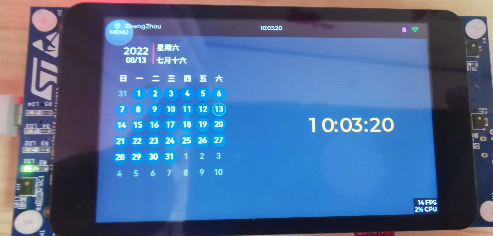
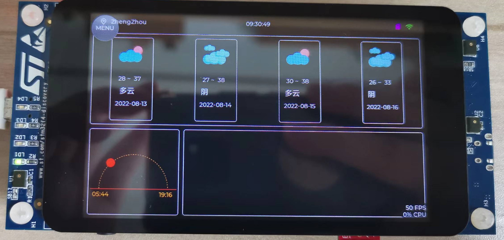
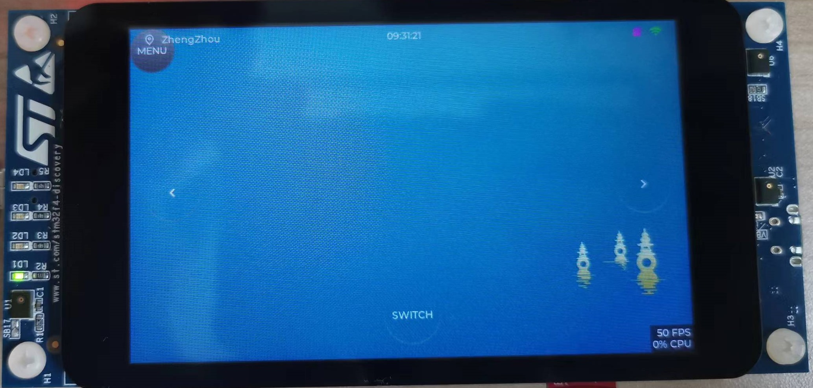

# Desktop electronic photo album based on RT-Thread and LVGL design

**English** | [中文](README.md) 
## Game description


  The code of this warehouse is mainly used to participate in the embedded GUI challenge held by the RT-Thread community. The link of the competition is as follows:

[https://club.rt-thread.org/ask/article/fdf5ad5909eef6ba.html](https://club.rt-thread.org/ask/article/fdf5ad5909eef6ba.html)

  I mainly want to design a desktop electronic photo album based on LVGL through this competition. The main functions include:

- Support for connecting to the Internet
- Support picture display, refresh pictures regularly
- Support to obtain local weather information
- Support access to domestic hot news
- Support to obtain picture information of other IoT cameras

  In this competition, I applied for the STM32F469-Discovery development board, thanks to RT-Thread for providing hardware support.

## demo video
  Video and picture description: Since the warehouse code is constantly updated, the demo interface and the actual function may be different.

[B站视频链接](https://www.bilibili.com/video/BV1aN4y1G7Ua)

## Hardware Description

- STM32F469-Discovery
	- MCU  STM32F469NIH6U 主频 180MHz，2048KB FLASH ，384KB (包含64KB 的 CCM) RAM
	- SRAM 25Q128A，16MB 
	- QSPI-FLASH 7LL12D9NOR，16MB
	- LCD：4寸800×480TFT屏

  Since the STM32F469-Discovery development board itself has no network module and has no networking capability, but it provides the standard hardware interface of Arduino UNO, we also need to design a WIFI module on the hardware to provide network connection function for STM32F469. The hardware is designed by myself, adapted to the STM32F469-Discovery development board, and the hardware is open source.

- ESP32-Arduino 
	- Based on ESP32-WROVER module


## Software Development Environment Description
  This project is built with Keil MDK5, and the configuration of rt-thread is built with the env tool.


## SD card storage directory description

   Note: The following directory structure needs to be created in the SD card now, and relevant examples are provided in the directory in the version repository tfcard, which can be directly copied to the SD card.


```
Directory /:
imgs                <DIR>  
tmp                 <DIR>  
conf                <DIR>  
tools               <DIR>  
album               <DIR>  
minimgs             <DIR>  

```

## System Profile Template

  The format of the system configuration file is in JSON format, which contains the following configuration information. The system configuration file is stored in the `/conf` directory .


```
 /conf/gui.conf
{
        "ssid": "wifissid",
        "passwd":       "1234567890",
        "apikey":       "********************************",
		"cityname":"zhengzhou",
        "cityid":       "101180101"
}
```
  The project implements the read-write function of the configuration file, and the system configuration parameters can be modified and set.

 

## feature design

- Main interface
	- Electronic album
	- Weather forecast
	- Daily news
	- Games
	- System settings

## hardware design

### ESP32-Arduino Custom Development Board Design

  The STM32F469-Discovery development board does not have a network card by default, but supports the standard Arduino UNO hardware interface. In order to support the network connection function, an ESP32-Arduino custom network card development board is specially designed for this development board. Serial communication is used between ESP32-Arduino and STM32F469-Discovery. The ESP32 is driven by the AT software package with RT-Thread to complete the network connection function.

  The hardware design part uses EasyEDA to complete the design work. The open source project link of ESP32-Arduino development board is as follows.

[https://oshwhub.com/piaoxuebingfeng/esp32_arduino_uno_type-c](https://oshwhub.com/piaoxuebingfeng/esp32_arduino_uno_type-c)

## software design

### Basic function building

#### STM32 FLASH scatter loading
  The STM32 on this development board has a built-in 2MB flash, which is absolutely sufficient for normal development of MCU programs. However, since this design is for GUI, a lot of image resources need to be introduced. In this case, the 2MB flash space will be enough. It seems a bit small, but fortunately there is a 16MB QSPI FLASH onboard on the development board. In this case, we must find a way to use this external FLASH. Most of the STM32 chips provide the FLASH scatter loading function, which means that the generated bin files can be disassembled at the same time and stored in different FLASH spaces. Here, we use the FLASH scatter-loading algorithm to save some larger necessary image data to external FLASH.

#### LVGL performance optimization
  The LVGL performance optimization part is simply optimized here, mainly to expand the LVGL framebuffer, use the LVGL double buffer, and use the external SRAM area. Specifically implemented in `applications/lvgl/lv_port_disp.c` .

```
#define LV_DISP_SRAM_START_ADDR (0xC0000000 + 10*1024*1024)

#define DISP_BUF_SIZE        (LV_HOR_RES_MAX * LV_VER_RES_MAX )
static lv_color_t  lv_disp_buf1[DISP_BUF_SIZE] __attribute__((at(LV_DISP_SRAM_START_ADDR+DISP_BUF_SIZE*2)))={0};
static lv_color_t  lv_disp_buf2[DISP_BUF_SIZE] __attribute__((at(LV_DISP_SRAM_START_ADDR+DISP_BUF_SIZE*4)))={0};

```
  In addition, the refresh cycle of LVGL is also set in `lv_conf.h`.
```
#define LV_DISP_DEF_REFR_PERIOD 20

```
#### Enable LVGL FS

  The LVGL officially provided by rt-thread has not yet connected to FS. Since external images need to be loaded in this design, the function of LVGL to connect to FS is required. RT-Thread provides the standard interface of DFS virtual file system, so in this project we directly connect to the interface provided by DFS. For specific implementation, please refer to `applications/lvgl/lv_port_fs.c`.

#### Enable UART6
  UART6 is not enabled in the bsp provided by rt-thread for stm32f469-discovery development board. Since UART6 and ESP32 are used for serial communication in this design to realize network function, UART6 needs to be enabled in the STM32 HAL driver.

#### ESP32 networking

  rt-thread provides at-device and at-socket components, which can be very convenient to use some network modules that communicate with AT command set. ESP32 is also one of the supported modules. With at-device, it is not necessary for developers to separately write programs for sending and receiving AT commands adapted to each network module. With at-socket, developers can also use the very familiar network socket programming method to write programs related to network connections.

  This set of network communication components provided by rt-thread greatly reduces the threshold for developing network applications in single-chip microcomputers, and is very easy to use.

#### get network data

 The webclient software package is provided in rt-thread. Using this software package, you can easily realize the sending and receiving of HTTP messages. At the same time, the package also provides the wget command, which is similar to wget in linux. It is also very convenient to test HTTP messages. Text sending and receiving function.


### interface design
  The code related to interface design is mainly in `applications/lv_desktop_gui/` directory . For detailed code, please check the relevant source code. Here are the main functions of each interface.

#### main interface design
  The main interface mainly realizes the functions of album rotation, time display and application switching.


#### clock interface
  The calendar function has been added to the clock interface to support the display of the lunar calendar, and the clock display function has been optimized and clock animation has been added.


#### Weather interface
  The weather interface realizes the real-time display of the weather in the next 5 days, and the function of sunrise and sunset display. Among them, I designed a sunrise and sunset control to realize the visualization of sunrise and sunset.


#### Album interface
  The album interface mainly realizes the rotation of local photos, and the background will periodically synchronize the pictures from the picture server to the local, so that there is no need to manually import the pictures into the local SD card, you can directly upload the pictures to the server to realize the photos. synchronization.



#### News interface
  The news interface is used to display news information in real time, and the news data mainly comes from the Tianxing database.


#### game interface
  The game interface implements the 2048 game, and the 2048 game is mainly ported to the lv_lib_100ask library open sourced by 100ask.


#### System configuration interface
  The system configuration interface currently only realizes the WIFI setting and city ID setting functions, which is relatively simple.


#### custom control

##### sunrise and sunset display controls
  The sunrise and sunset controls are written using the lv_canvas component, and currently support the display of sunrise and sunset times, as well as the current position of the sun.

##### Custom Calendar Control
  The calendar control that comes with LVGL8.2 has canceled the modification style related API, and the style of the default LVGL calendar control is not very good-looking. Therefore, the author added some style support by modifying the source code of the calendar control, and encapsulated the The following calendar controls have added support for the display of lunar calendar dates, forming the calendar in the current UI design.

### Networking

#### Data interface API
  The data interface of several websites is used in this design.
##### News data interface

  The news data is obtained through the Tianxing Data API . The `http://api.tianapi.com/bulletin/index?key=APIKEY`,APIKEY needs to be applied by the user and added to the `/conf/gui.conf` configuration file. The data format returned by the news data interface is JSON data format.


##### Weather Data Interface
  The weather data interface uses `sojson.com` a free weather API interface, which can obtain domestic 15-day city weather information without using APIKEY `http://t.weather.sojson.com/api/weather/city/cityid`, where cityid is the city id. The data format returned by the weather data interface is also in JSON format.

### System Configuration

​    The system configuration interface mainly implements functions such as system WIFI network configuration, city configuration, system version viewing, and desktop background style switching.

### problems solved

#### ESP32 AT-Device component fails to resolve DNS
  At the beginning, I debugged the AT-Device component of ESP32 and found that the WIFI can be connected normally, but every HTTP request is always abnormal. After some investigation, it was found that the dns parsing function of esp32 was abnormal. After modifying the code of the at-device component, the problem was solved. The specific modified files are the `at_device/class/esp32/at_device_esp32.c` main modified contents. The related patches are as follows:

```
---
 class/esp32/at_device_esp32.c | 2 +-
 1 file changed, 1 insertion(+), 1 deletion(-)

diff --git a/class/esp32/at_device_esp32.c b/class/esp32/at_device_esp32.c
index 1d57ebe..1f2424f 100644
--- a/class/esp32/at_device_esp32.c
+++ b/class/esp32/at_device_esp32.c
@@ -304,7 +304,7 @@ static int esp32_netdev_set_dns_server(struct netdev *netdev, uint8_t dns_num, i
     }
 
     /* send dns server set commond "AT+CIPDNS_CUR=<enable>[,<DNS    server0>,<DNS   server1>]" and wait response */
-    if (at_obj_exec_cmd(device->client, resp, "AT+CIPDNS_CUR=1,\"%s\"", inet_ntoa(*dns_server)) < 0)
+    if (at_obj_exec_cmd(device->client, resp, "AT+CIPDNS=1,\"%s\"", inet_ntoa(*dns_server)) < 0)
     {
         LOG_E("%s device set DNS failed.", device->name);
         result = -RT_ERROR;
-- 
```

#### STM32-Discovery touch Driver
  The problem is mainly caused by the touch screen driver IC on the development board that the author got. At present, it is known that there are two driver ICs on the development board, one is FT6206, and the other is the one that the author has obtained. For FT6336G, the capacitive touch driver does not work properly due to the lack of compatibility verification in the bsp package. After communicating with people in the community, the problem has been solved, and the relevant changes have been merged into bsp.


## reference design

[lv_lib_100ask](https://gitee.com/weidongshan/lv_lib_100ask)

## Thanks

  After more than a month of coding tests, the desktop photo album based on STM32F469-Discovery has a V1.0 version. Due to work reasons, the author's job is no longer RTOS development, but he is still interested in embedded RTOS and can only study and research in his spare time. Up to now, the RT-Thread embedded real-time operating system is still one of the few excellent systems for the IOT field, and the community is still very active, and the introduced software packages are quite easy to use. Using RT-Thread can greatly reduce the framework construction work of developers and focus on business development and function implementation. I am very grateful to the RT-Thread team for developing such an excellent IOT operating system, which is small, easy to use and powerful.

  During the realization of the competition works, the time off work and weekends were selected to participate in this competition, and there was not much time to do housework and take care of the baby during the process. I am also very grateful to my wife and parents, who are silently supporting me in pursuing my hobbies and hobbies, and are also silently contributing to my family.

  Although this competition has a deadline, I don't want to stop the current development work. The current version is only V1.0, and some performance problems and usability problems have not been solved. . With this competition, the RT-Thread team helped to collect development boards from all over the world and provided them to us developers and enthusiasts. I am very grateful to RT-Thread for their strong support. I will also take time to improve this based on the development board. work.


## Content to be improved

  Due to the progress of this development time, there are still many areas to be optimized and improved. Therefore, targeted optimization and iteration will be carried out for this project in the future.


